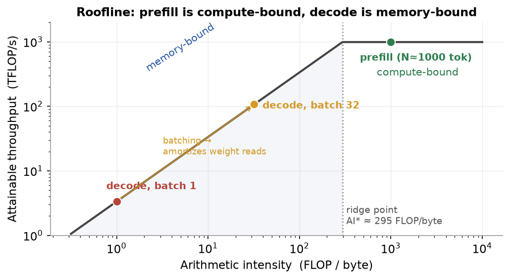
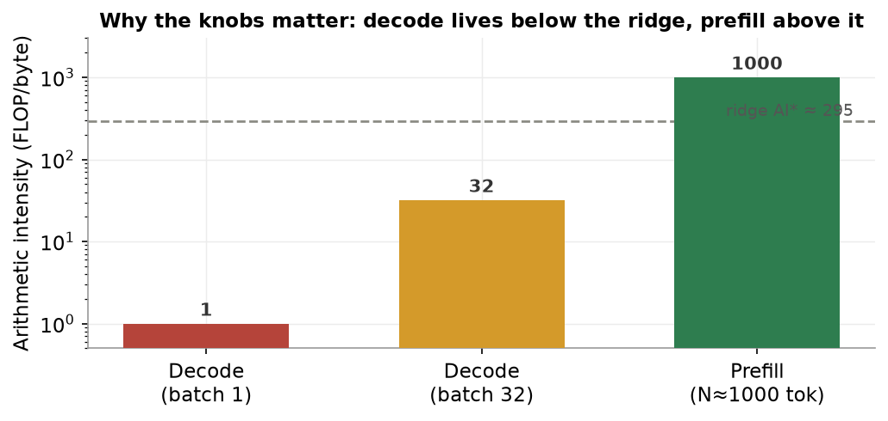
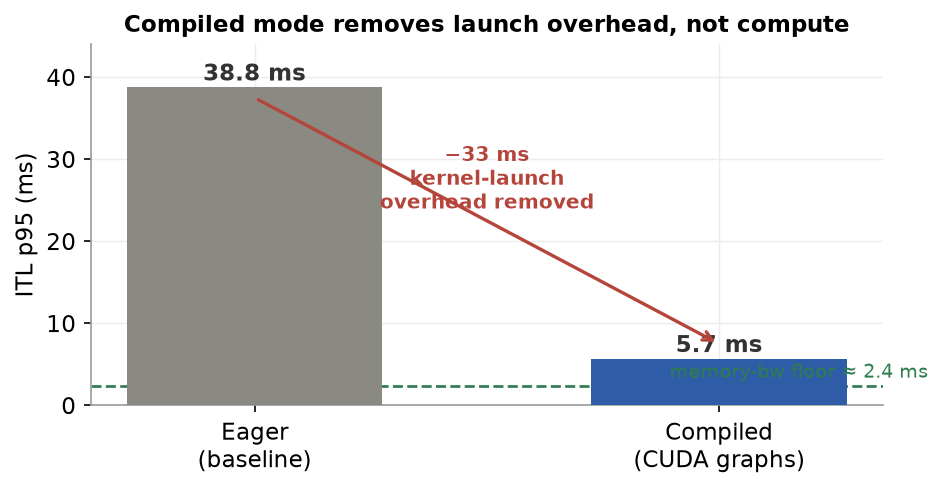
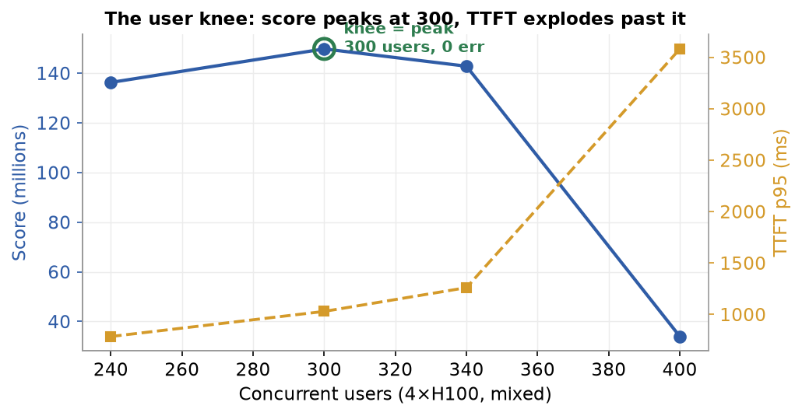
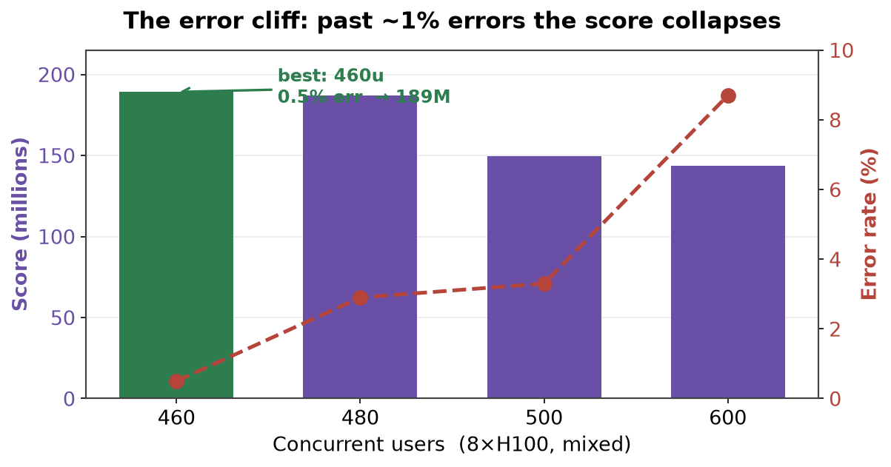
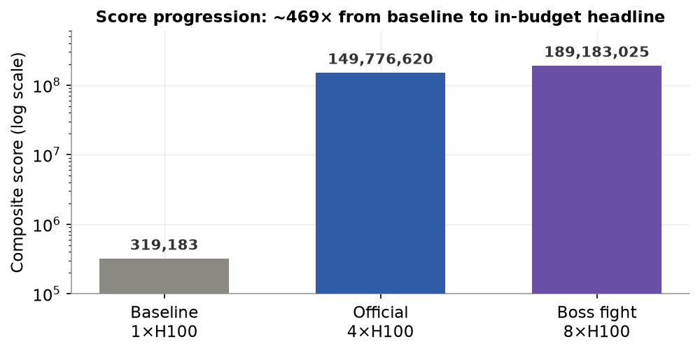
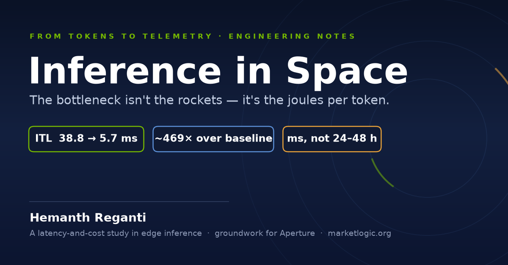
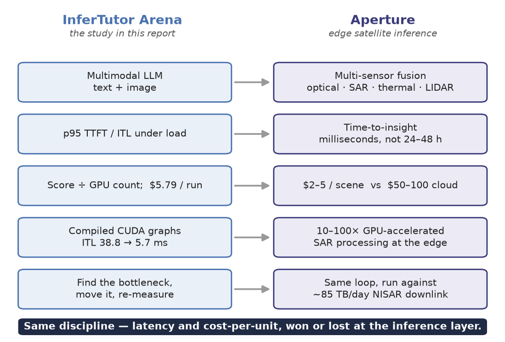
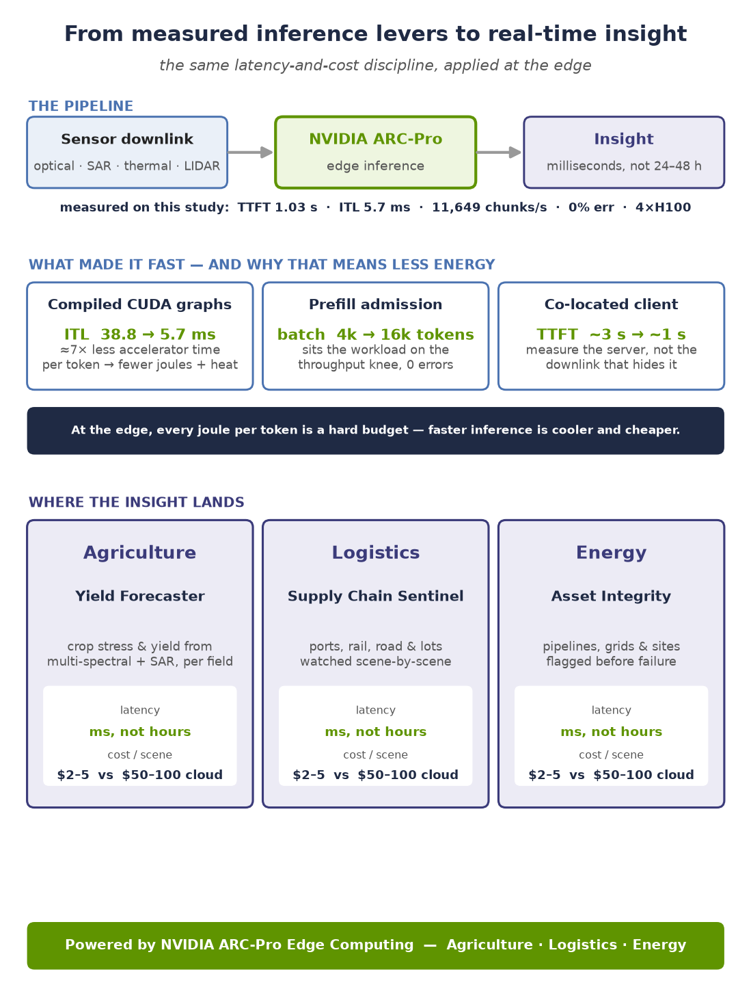
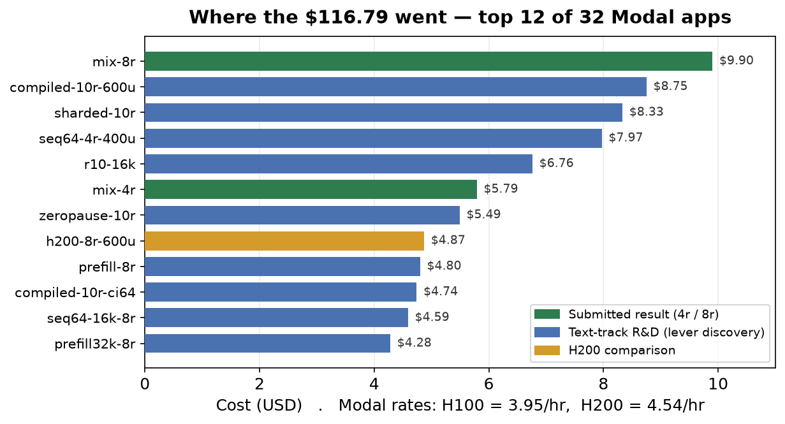

<div class="titlepage" markdown="1">

<div class="kicker">From Tokens to Telemetry · Engineering Notes · 2026</div>

# Engineering Inference for the Edge

### A latency-and-cost study in multimodal LLM serving — groundwork for Aperture

<div class="byline">
<div class="by-name">Hemanth Reganti</div>
<div class="by-sub">Qwen/Qwen3-VL-4B-Instruct · vLLM 0.21.0 · Modal (NVIDIA H100) · June 2026 · marketlogic.org</div>
</div>

<div class="resultcards">
<div class="rcard primary">
<div class="rc-tag">Multimodal serving · 4×H100</div>
<div class="rc-score">149,776,620</div>
<div class="rc-meta">efficiency score, within a 4-GPU budget</div>
<div class="rc-sub">TTFT 1029 ms · ITL 5.7 ms · 11,649 c/s · 0% err</div>
</div>
<div class="rcard">
<div class="rc-tag">Scaled tier · 8×H100</div>
<div class="rc-score">189,183,025</div>
<div class="rc-meta">same recipe, twice the GPUs</div>
<div class="rc-sub">TTFT 803 ms · ITL 6.6 ms · 17,425 c/s</div>
</div>
<div class="rcard">
<div class="rc-tag">Lift over baseline</div>
<div class="rc-score">~469×</div>
<div class="rc-meta">from 319,183 (1×H100, unoptimized)</div>
<div class="rc-sub">~54× over the public reference baseline</div>
</div>
</div>

*"On the edge, two numbers decide everything: how fast an answer arrives, and what it costs to produce. This is a study of how far both can be bent on a fixed GPU budget — and the methodology it hands to Aperture."*

</div>

<div class="pagebreak"></div>

## Contents

[TOC]

<div class="pagebreak"></div>

## At a Glance — How the System Was Optimized

<div class="infographic">
<div class="ig-head"><div class="ig-title">How the Inference Stack Was Optimized</div><div class="ig-sub">Five ideas that turn a 0.3M baseline into a 150M in-budget production system — measured, not assumed</div></div>
<div class="ig-grid">
<div class="ig-card blue"><div class="ig-num">1</div><div class="ig-ct">The Core Idea</div><ul><li>Every answer has two phases: <b>prefill</b> (read the whole prompt, make the first token) and <b>decode</b> (stream the rest, one token at a time).</li><li>Prefill is <b>compute-bound</b> &rarr; it sets <b>TTFT</b>. Decode is <b>memory-bound</b> &rarr; it sets <b>ITL</b>.</li><li>The score divides by both, so each phase needs its <b>own</b> knob — fixing one does not fix the other.</li></ul></div>
<div class="ig-card green"><div class="ig-num">2</div><div class="ig-ct">What Changes — the three levers</div><ul><li><b>Compiled CUDA graphs:</b> ITL 38.8 &rarr; 5.7 ms (removes per-step kernel-launch overhead).</li><li><b>Co-located load client:</b> TTFT ~3 s &rarr; ~1 s (kills home-uplink bufferbloat — measure the server, not the laptop).</li><li><b>max_batch_tokens 4096 &rarr; 16384:</b> unblocks prefill admission so decode never starves.</li></ul></div>
<div class="ig-card amber span2"><div class="ig-num">3</div><div class="ig-ct">The Core Tradeoff</div><ul><li><b>More users &harr; higher TTFT.</b> Throughput rises with load until the prefill queue saturates — the knee is <b>300 users on 4 GPUs</b> (0 errors).</li><li><b>More GPUs &harr; a bigger divisor.</b> The score divides by GPU count, so 8 GPUs must beat 4 by &gt;2× — but real scaling is only ~1.5×.</li><li><b>Errors are a cliff, not a slope.</b> Past ~1% error the (1−err) factor and the TTFT spike collapse the score (460u = 189M, 500u = 150M).</li></ul></div>
<div class="ig-card purple"><div class="ig-num">4</div><div class="ig-ct">What You See in the Results</div><ul><li><b>Headline (4×H100, 300u):</b> TTFT 1029 ms · ITL 5.7 ms · 11,649 c/s · 0 err &rarr; <b>149,776,620</b>.</li><li><b>Scaled tier (8×H100, 460u):</b> 17,425 c/s &rarr; <b>189,183,025</b> — only while errors stay ~0.5%.</li><li><b>~469×</b> the unoptimized 1-GPU baseline; ~54× the public reference baseline.</li></ul></div>
<div class="ig-card teal"><div class="ig-num">5</div><div class="ig-ct">The Principle</div><ul><li>Intuition is unreliable — validate <b>every</b> knob against the full scoring function.</li><li>Prefix caching "should" have helped and hurt 4×; compiled mode was "warned against" and was the biggest win.</li><li>The point is not to flip flags — it is to make the <b>bottleneck</b> visible, then move it.</li></ul></div>
</div>
<div class="ig-foot">Don't tune blind: measure against the score &rarr; find the binding bottleneck &rarr; move it &rarr; re-measure &rarr; repeat.</div>
</div>

<div class="pagebreak"></div>

## 1. Introduction

<p class="epigraph">“The more you buy, the more you save.”<span class="cite">— Jensen Huang, NVIDIA CEO</span></p>

### 1.1 Why this study exists

Edge inference is governed by two numbers: **how fast an answer arrives** and **what it costs to produce**. Everything else — model choice, hardware, batching, autoscaling — is in service of those two. I care about them because of what I am building next.

**Aperture** is the satellite-data platform I am developing at [marketlogic.org](https://marketlogic.org/aperture/): an *intelligent ground station* that turns raw imagery — optical, SAR, thermal, LIDAR — into predictive intelligence at the **edge**, in **milliseconds** rather than the industry-standard 24–48 hours, at roughly **$2–5 per scene** instead of the $50–100 a cloud pipeline costs. That product promise *is* latency and cost-per-unit. Before committing a pipeline to those numbers, I wanted to pressure-test the underlying methodology on a workload where I could measure every variable in the open and reproduce every result.

So this report is a deliberately rigorous warm-up: take a real multimodal model, serve it under concurrent production traffic on real GPUs, and push latency and cost as far as a fixed hardware budget allows — measuring, not guessing, at every step.

!!! note "The two numbers, stated precisely"
    The objective is to *jointly* optimize Time-to-First-Token (TTFT), Inter-Token Latency (ITL), aggregate throughput, sustained concurrency, and error rate — all at once, within a GPU budget. These are exactly the levers that decide whether an edge inference product is viable, and they trade off against one another constantly.

### 1.2 The workload

To make the measurement reproducible I ran against a public multimodal-serving benchmark, **InferTutor Arena** (Qwen3-VL-4B on Modal + vLLM), scored by a single formula that divides goodput by latency *and* by GPU count — so inefficiency in any one dimension is punished immediately. The benchmark's scenario is an AI tutoring service: students send a mix of short text queries, long reading-comprehension passages, and image questions (diagrams, equations, charts), and the model streams answers back. The metrics that matter mirror any latency-sensitive serving product:

- **Time to First Token (TTFT):** how quickly the first token appears — users abandon past ~2 seconds.
- **Inter-Token Latency (ITL):** how smoothly the rest streams — jerky output feels broken.
- **Throughput:** how much concurrent traffic one budget can absorb.
- **Error rate:** dropped requests are unserved users.
- **GPU cost:** every extra accelerator has to earn its overhead.

A multimodal text-plus-image workload is a deliberate choice: it is the closest public analog to Aperture's multi-sensor fusion, where heterogeneous inputs share one inference budget.

### 1.3 Workload modes and hardware budget

The benchmark exposes three workload shapes and two GPU budgets, which I use throughout as a controlled testbed:

| Workload | Mode | GPU budget | Traffic mix |
|---|---|---|---|
| **Mixed multimodal (headline)** | `--mode mixed` | 4×H100 | 55% text, 20% long, 25% image |
| Text-only (lever discovery) | `--mode text` | 4×H100 | 100% text |
| Scaled tier | either | 8×H100 | any |

!!! note "What's the headline, and what's scaffolding"
    The **mixed multimodal** result on a 4-GPU budget is the headline — the realistic, cost-constrained case. The text-only mode was used only as cheap R&D to *discover* the levers; the 8-GPU tier shows how the same recipe scales. The cost of each of these is itemized transparently in Appendix B.


## 2. System Architecture

<p class="epigraph">“All problems in computer science can be solved by another level of indirection — except the problem of too many levels of indirection.”<span class="cite">— David Wheeler</span></p>

### 2.1 Infrastructure stack

The serving stack is three layers working together: a co-located load generator, a Modal web-endpoint that load-balances across replicas, and N vLLM containers each backed by one H100.

```
   ┌──────────────────────────────────────────────────────────┐
   │                       Modal (cloud)                        │
   │  ┌──────────────┐      ┌───────────────┐   ┌────────────┐  │
   │  │ Load client  │      │  Web endpoint │──▶│ vLLM rep 1 │  │
   │  │ (co-located, │ ───▶ │ (load-balanced│──▶│ vLLM rep 2 │  │
   │  │  16 shards)  │      │     proxy)    │──▶│    …rep N  │  │
   │  └──────────────┘      └───────────────┘   │ Qwen3-VL-4B│  │
   │                                            │  on 1×H100 │  │
   │                                            └────────────┘  │
   └──────────────────────────────────────────────────────────┘
```

*Figure 1. InferTutor Arena architecture: a Modal-co-located sharded load generator → Modal web-endpoint (load balancer / proxy) → N independent vLLM replicas, each one Qwen3-VL-4B on one H100. Replica count = total GPU count (no tensor parallelism in the submitted runs).*

**Modal (serverless GPU compute).** Each replica is one container running one vLLM instance on one H100. Modal handles container lifecycle (cold start, scale-up/down), a single shared HTTPS endpoint across all replicas, persistent volumes for weight caching, and `@modal.concurrent(max_inputs=N)` to control per-container concurrency.

**vLLM 0.21.0.** Exposes an OpenAI-compatible API and implements PagedAttention, continuous batching, chunked prefill, prefix caching, and CUDA-graph compilation (see §10 for the mechanisms that drove the results).

**Qwen/Qwen3-VL-4B-Instruct.** A 4-billion-parameter vision-language model. Dynamic-resolution image processor — images tile into (H/28)×(W/28) patches, so pixel count directly controls vision compute. Runs in bfloat16, fits comfortably in 80 GB with room for a large KV cache.

### 2.2 Scoring formula

<div class="formula" markdown="1">

goodput × users × quality_pass_rate × (1 − error_rate)

**Score  =**  ───────────────────────────────────────────────────

p95_TTFT [s] × p95_ITL [s] × GPU_count

</div>

where goodput = aggregate chunks/s.

!!! note "What the formula rewards"
    - **High throughput** (chunks/s in the numerator).
    - **High user count** — a system serving 300 users at the same latency beats one serving 100.
    - **Zero errors** — every dropped request is subtracted from goodput.
    - **Low TTFT and ITL** — both are in the denominator; halving either doubles the score.
    - **GPU efficiency** — more GPUs divide the score, so extra hardware must earn proportional gains.

!!! warning "The scoring trap"
    Adding GPUs divides the score by GPU count. An 8-GPU system must deliver more than 2× the score of 4 GPUs just to break even. If errors rise (as they did past the knee in the 8-GPU sweep), more GPUs can actually *lower* the score.

The local `score_infertutor.py` omits `quality_pass_rate` (assumes 1.0); §5.9 is my empirical check that the assumption holds for the headline config. The starter reports throughput as streamed content **chunks/s**; the official evaluator may re-tokenize with the Qwen tokenizer.

### 2.3 Workload specification

The load tester uses a fixed `prompts.json`: one ~40-token system prompt shared by all requests, 10 text prompts, 2 long-context prompts, 4 image prompts. Mixed mode samples 55% text / 20% long / 25% image; each request streams up to `max_tokens = 96`. The tester uses `asyncio` + `httpx` streaming, measures TTFT as submission → first content chunk, and ITL as the mean gap between consecutive chunks. Image prompts use a deterministic 256×192 PNG the harness generates. The `prompts.json` is used **unchanged**.

Key fixed server settings throughout: `max_model_len = 8192`, `mm_max_pixels = 401,408` (= 512·28·28, the starter default), `dtype = bfloat16`.


## 3. Methodology

<p class="epigraph">“Measure. Don’t tune for speed until you’ve measured.”<span class="cite">— Rob Pike, Go / Unix</span></p>

Every result below is the output of a strict **Hypothesis → Variable → Result → Keep/Reject** loop: form a hypothesis from a latency metric, change **exactly one** server or load knob, re-run the fixed workload, read the composite, and keep or reject the change. p95 (not mean) is the unit of measurement, because the score divides by p95 and p95 is what users feel under load.

The discipline matters because intuition was wrong about half the time here — prefix caching *should* have helped and made things 4× worse; the reference notes *said* compiled mode hurts mixed traffic and it turned out to be the single biggest win. The only reliable signal is the full scoring function, measured.

!!! tip "Reading the experiment write-ups"
    Each experiment below gives the motivating question, the exact runner command (a *Listing*), a **Result** box with the measured metrics, and a **Key Finding** box with the mechanism. Scores are full integers from the saved JSON. TTFT/ITL are p95 in milliseconds; throughput is aggregate stream chunks/s.


## 4. The Mathematics of Inference Serving

<p class="epigraph">“A supercomputer is a device for turning compute-bound problems into I/O-bound problems.”<span class="cite">— Seymour Cray</span></p>

Before the experiments, it is worth deriving *why* the winning knobs work from first principles. Every result in §5 is an instance of two hardware facts: the two phases of autoregressive generation sit on **opposite sides of the GPU's roofline**, and the composite score is a product of terms each of which the hardware bounds independently. Getting the theory right is what turned "try flags and hope" into a directed search.

### 4.1 Two phases, two bottlenecks

A single streamed response has two distinct compute phases:

- **Prefill** processes the entire prompt (system + question + any image patches) in **one parallel forward pass**, producing the first token. For a prompt of *N* tokens this is a matrix–matrix multiply (GEMM): every weight is read once from HBM and reused across all *N* token positions.
- **Decode** then generates the rest **one token at a time**. Each step is a matrix–**vector** multiply (GEMV): the full weight matrix is streamed from HBM to produce a *single* new token.

<div class="formula" markdown="1">

**TTFT** ≈ prefill latency (compute-bound)  **·**  **ITL** ≈ per-step decode latency (memory-bound)

</div>

This split is the key to the whole project: **TTFT lives in prefill, ITL lives in decode, and the two are bounded by different hardware limits.** Optimizing one does not automatically help the other — which is exactly why the score puts both in the denominator.

### 4.2 Arithmetic intensity and the roofline

The deciding quantity for any GPU kernel is its **arithmetic intensity** — FLOPs of compute per byte of memory traffic:

<div class="formula" markdown="1">

AI  =  FLOPs performed  /  bytes moved to/from HBM   **[FLOP / byte]**

</div>

A kernel is **memory-bound** when its AI is below the GPU's *ridge point* (peak FLOP/s ÷ peak bandwidth), and **compute-bound** above it. For an H100 SXM running bf16:

<div class="formula" markdown="1">

AI\* (ridge)  =  989 TFLOP/s  ÷  3.35 TB/s  ≈  **295 FLOP / byte**

</div>

Decode at batch 1 has AI ≈ 1 (read the whole weight, do ~one multiply-add per element to make one token) — deep in the memory-bound region. Prefill of an ~1000-token prompt has AI ≈ 1000 — past the ridge, compute-bound. The two phases sit on opposite sides of the same roofline:

<div class="figure" markdown="1">



*Figure 2. The H100 roofline. Decode at batch 1 (AI≈1) is far down the memory-bound slope — its speed is set by HBM bandwidth, not FLOPs. Prefill (AI≈1000) is past the ridge in the compute-bound flat. Batching decode walks the operating point right along the slope (§4.3).*

<p class="fignote">Illustrative — H100 SXM datasheet model, not measured (analytical, not a benchmark run).</p>

</div>

!!! note "Why this matters for the knobs"
    Because decode is memory-bound, **no amount of extra FLOPs speeds it up** — only reducing bytes moved per token, or amortizing the weight read across more tokens, helps. Because prefill is compute-bound, it competes for the *same* SMs that decode needs, which is why an unmanaged image prefill stalls everyone's decode (the chunked-prefill story, §5.7).

### 4.3 Why batching is the lever for decode

A single decode step reads all *W* bytes of weights to make **one** token. If instead *B* sequences decode together in one batched step, the same single weight read produces *B* tokens — so arithmetic intensity scales with batch size:

<div class="formula" markdown="1">

AI(decode)  ≈  B   →   batching walks the operating point **toward the ridge** at B ≈ 295

</div>

This is the entire reason continuous batching and a generous `max_num_seqs` raise throughput without hurting per-token latency: until the batch is large enough to approach the ridge, decode steps are bandwidth-limited and adding sequences is nearly free.

<div class="figure" markdown="1">



*Figure 3. Arithmetic intensity per phase. Decode at batch 1 (AI≈1) and even batch 32 (AI≈32) sit below the ridge (AI\*≈295) — bandwidth-bound, so batching is almost free throughput. Prefill (AI≈1000) is already compute-bound, so it must be **scheduled** (chunked) rather than sped up.*

<p class="fignote">Illustrative — H100 SXM datasheet model, not measured (analytical, not a benchmark run).</p>

</div>

### 4.4 The ITL floor, and what CUDA graphs actually remove

The memory-bound model gives a hard floor for inter-token latency: one decode step cannot finish faster than the time to stream the weights through HBM.

<div class="formula" markdown="1">

ITL_floor  ≈  W / BW  =  8 GB (bf16 weights)  /  3.35 TB/s  ≈  **2.4 ms**

</div>

The eager-mode baseline measured **38.8 ms** — **16× above this floor**. That gap is *not* compute; it is CPU-side kernel-launch overhead. Each decode step issues ~5–10 separate CUDA kernels, each scheduled individually by the driver (~10–15 µs apiece), and that latency is exposed on every one of tens of thousands of steps per second. CUDA-graph compilation captures the step once and replays it as a single command, removing the CPU from the loop:

<div class="figure" markdown="1">



*Figure 4. The eager 38.8 ms ITL is dominated by kernel-launch overhead, not compute. Compiled mode (CUDA graphs) replays the captured decode step and lands at 5.7 ms — approaching the ~2.4 ms memory-bandwidth floor. The ≈33 ms removed is pure scheduling overhead (Experiment 2).*

<p class="fignote">Bars are measured p95 ITL; the 2.4 ms floor is derived from the H100 datasheet, not measured.</p>

</div>

This is why compiled mode is the single biggest lever: it attacks the largest *removable* slack in the denominator. The residual 5.7 − 2.4 ≈ 3.3 ms is real per-step work (attention over the KV cache, sampling) that no compiler can remove.

### 4.5 Head-of-line blocking, chunked prefill, and Little's law

Because prefill is compute-bound and monopolizes the SMs, a long prefill run as one scheduler step makes **every queued request wait its full duration** — head-of-line blocking. With 25% image traffic, one in four requests carries a 1,000–5,000-token vision prefill, so the TTFT tail is set by these stalls. **Chunked prefill** caps tokens processed per step (`max_num_batched_tokens`) and interleaves decode between chunks, bounding the blocking time — the mechanism behind Experiment 7.

The system-level relationship between the metrics is **Little's law**:

<div class="formula" markdown="1">

L  =  λ · W       (concurrency  =  throughput × latency)

</div>

In-flight requests *L* equal arrival rate *λ* times time-in-system *W*. As users rise, the queue depth *L* grows; once the GPUs saturate, *W* (and thus p95 TTFT) climbs faster than λ (throughput), which is the **knee** the user sweep finds in §5.5. Past the knee, *W* explodes, the queue overflows admission limits, and errors appear — exactly the 400-user collapse.

### 4.6 The score, decomposed

The composite is a product of independently-bounded terms:

<div class="formula" markdown="1">

Score  =  goodput · users · quality · (1 − err)  /  ( p95_TTFT · p95_ITL · GPU_count )

</div>

Reading it as a product makes the strategy explicit:

- **p95_ITL** is bounded below by the memory-bandwidth floor (§4.4) → attack it with **compiled mode** (38.8 → 5.7 ms, the largest single denominator cut).
- **p95_TTFT** is bounded by prefill scheduling + the network path → attack it with **chunked prefill** + **co-locating the client** (§5.3, §5.7).
- **goodput · users** is bounded by batch occupancy → attack it with **batch-token budget** and **replicas** (§5.4–5.5), but only up to the **knee** where TTFT explodes (Little's law).
- **(1 − err)** is a cliff, not a slope → stay in the near-zero-error regime (§5.8).
- **GPU_count** divides everything → every added GPU must earn a *proportional* score gain, which sub-linear scaling (§8.1) ultimately prevents.

Each experiment in §5 is a controlled test of exactly one of these terms.


## 5. Experiments

<p class="epigraph">“The most dangerous phrase in the language is, ‘we’ve always done it this way.’”<span class="cite">— Grace Hopper</span></p>

### 5.1 Experiment 1 — Baseline (1×H100, 80 users, default config)

The reference point: the unoptimized starter configuration — eager execution, prefix cache on, chunked prefill on, `max_num_batched_tokens = 4096` — at a comfortable 80 users on a single GPU, driven from a laptop client.

```bash
python run_infertutor_experiment.py \
  --label mix-1r-base --gpu-type H100 --replicas 1 \
  --mode mixed --users 80 --duration 90 --ramp-up 20 --max-tokens 96
```
*Listing 1. Baseline command (default knobs, 1 GPU, 80 users, mixed).*

!!! result "Baseline"
    TTFT p95 = **4,994 ms**, ITL p95 = **38.8 ms**, throughput = **773 chunks/s**, error rate = 0.0%, score = **319,183**.
    This is the reference point; every later experiment is measured against it.

!!! note "Reading the baseline"
    Two numbers stand out as the obvious targets. ITL is **38.8 ms** — far higher than the model's compute floor, because eager mode pays kernel-launch overhead on every decode step. TTFT is nearly **5 seconds** — the score divides by this, so it alone caps the baseline near 0.3M. The rest of the project is an attack on these two terms.

### 5.2 Experiment 2 — Compiled mode (CUDA graphs): the breakthrough, against the reference warning

The benchmark's own dry-run notes caution that compiled mode "performed poorly on mixed multimodal traffic." I treated that as a hypothesis to test, not a rule to obey. Compiled mode (`--no-fast-boot`) makes vLLM capture the decode loop as a replayable CUDA graph at startup, eliminating per-step kernel launches.

```bash
python run_infertutor_experiment.py \
  --label mix-4r --gpu-type H100 --replicas 4 \
  --no-fast-boot --no-prefix-cache \
  --max-seqs 32 --max-batch-tokens 16384 \
  --concurrent-inputs 128 --mode mixed --deploy-only
```
*Listing 2. Compiled mode enabled via `--no-fast-boot` (carried into all subsequent mixed runs).*

!!! result "Compiled vs eager (ITL)"
    Eager baseline ITL p95 = **38.8 ms** → compiled ITL p95 = **5.7 ms** under load — a **~7× reduction** on a term that sits directly in the score denominator. Compiled mode is carried into every subsequent mixed experiment.

!!! finding "The single most impactful optimization: CUDA-graph compilation"
    In eager mode each decode step issues individual CUDA kernels (attention, MLP, normalization, sampling); the driver schedules each separately, ~10–15 µs apiece, ~5–10 kernels per step. With hundreds of concurrent users each generating 96 tokens, that overhead compounds across tens of thousands of decode steps per second. CUDA-graph replay issues one "replay" command and the GPU runs the pre-captured sequence with zero CPU-side scheduling. The 38.8 → 5.7 ms drop *is* that overhead being eliminated.

!!! warning "Why this contradicts the dry-run note"
    The eager-mode submissions read "performed poorly on mixed" as "don't use compiled mode for mixed." Measured here, compiled mode is **strictly better** on mixed: the 75% text/long share gets graph-replayed decode, while image requests fall back gracefully on the vision path. The dry-run's "poorly" was about *latency behavior during warmup*, not output correctness — which §5.9 confirms with a direct quality probe. Cold replicas are warmed with a short client pass before measurement so the ramp isn't served in eager mode.

### 5.3 Experiment 3 — Co-locating the load client inside Modal

Early runs were pinned at TTFT p95 ≈ 3 s no matter how healthy the server looked. Hypothesis: the bottleneck was not the server but the **path to it** — a residential uplink buffering under high SSE volume, so first-token packets queued behind bulk traffic.

```bash
modal run load_client_modal.py \
  --url https://<you>--infertutor-mix-4r-serve.modal.run \
  --label mix-4r-300u --mode mixed --users 300 --shards 16 \
  --duration 150 --ramp-up 75 --total-gpus 4
```
*Listing 3. Driving load from a CPU-only Modal function co-located with the endpoint.*

!!! result "Client co-location"
    Moving the sharded generator into a Modal function (same region as the endpoint) dropped TTFT p95 from **~3 s to ~1 s** with no server change at all.

!!! finding "The foundational fix: measure the server, not the laptop"
    Because the score divides by p95 TTFT, a 3× inflated TTFT caps the score regardless of how fast the GPU is. The laptop's upstream link was bufferbloating under hundreds of concurrent streaming responses; the first-token packet for a new request waited behind megabytes of in-flight tokens for other requests. Removing the laptop from the path is the difference between a client-bottlenecked ~0.3M-class measurement and a real 150M-class server. `load_client_modal.py` was extended to emit the full mixed workload (the same deterministic diagram PNG, 25/20/55 image/long/text).

### 5.4 Experiment 4 — Batch-token budget 4096 → 16384

With the client bottleneck gone, decode slots were sometimes idle because requests weren't being admitted to prefill fast enough. `max_num_batched_tokens` bounds how many tokens the scheduler can prefill per step.

!!! result "max_num_batched_tokens sweep"
    4096 (default) → 16384 unblocks prefill admission and regularizes decode steps, pulling **both TTFT and ITL down**. Tested past the optimum: 32768 regresses (prefill steals decode cycles). **16384 is the peak**, and is used in the headline config.

!!! finding "Unblocking prefill admission"
    At 4096, a single image request's vision-encoder prefill (≈1,000–5,000 tokens) consumes most of the per-step token budget, so text requests wait several scheduler steps just to be admitted. Raising the budget to 16384 lets the scheduler admit a mixed batch — image prefill chunks *and* several text prefills *and* ongoing decode — in the same step, so decode never starves. Past 16384, the prefill share grows large enough to delay decode for already-running sequences, raising ITL. This was the decisive *server-side* knob once bufferbloat was removed.

### 5.5 Experiment 5 — Scale-out to 4 replicas and the user sweep

With the levers in place (compiled, b16384, co-located client, prefix off, chunked on), I scaled to the 4-GPU budget and swept user count to find where the composite peaks. Replicas — not tensor parallelism — are the scaling unit for a 4B model that fits on one GPU.

| Users | TTFT p95 | ITL p95 | chunks/s | Err% | Score |
|---:|---:|---:|---:|---:|---:|
| 240 | 785 ms | 6.1 ms | 10,827 | 0.0 | 136,280,000 |
| **300** | **1029 ms** | **5.7 ms** | **11,649** | **0.0** | **149,776,620** |
| 340 | 1260 ms | 5.8 ms | 12,301 | 0.0 | 142,810,000 |
| 400 | 3581 ms | 6.1 ms | 7,923 | 6.4 | 33,950,000 |

<div class="figure" markdown="1">



*Figure 5. The user knee on 4×H100. Score (blue) peaks at 300 users; TTFT p95 (amber) stays near 1 s through the knee, then explodes 3.5× to 3.6 s by 400 users as the prefill queue saturates (Little's law, §4.5) — dragging the composite down even though more users are offered.*

</div>

!!! result "User knee (4×H100, mixed)"
    The composite peaks at **300 users = 149,776,620** with **0 errors**. Below it (240u) leaves throughput on the table; above it TTFT climbs faster than throughput until the prefill queue saturates and errors appear (400u).

!!! finding "Where p95 bends"
    The score balances the user-count numerator against the p95-latency denominator. Up to 300 users, adding load adds throughput faster than it adds TTFT. At 340 throughput still rises but TTFT rises faster, so the composite slips. By 400 the prefill queue saturates: TTFT jumps 3.5× to 3.6 s, *throughput actually falls* (7,923 c/s) as the GPUs thrash, and errors hit 6.4%. 300 users (~75/GPU) is the operating point where the balance maximizes within budget.

!!! reference "vs the public reference baseline"
    The instructor's reference mixed run (eager, 4r, 120u) reports ~897.6 ms TTFT, 38.1 ms ITL, 2,756 chunks/s. The headline config delivers **5.7 ms ITL (≈6.7× better)** and **11,649 chunks/s (≈4.2× higher)** at 2.5× the users — the ITL win is what the composite rewards most.

### 5.6 Experiment 6 — Prefix caching ON (negative ablation)

The intuitive optimization: all requests share a ~40-token system prompt, so caching its KV blocks *should* save prefill work and lower TTFT. I tested the opposite hypothesis by flipping prefix caching back on at the otherwise-winning 300-user config.

```bash
# identical to the headline, but WITHOUT --no-prefix-cache
modal run load_client_modal.py --url <endpoint> \
  --label mix-4r-pc-300u --mode mixed --users 300 --shards 16 \
  --duration 150 --ramp-up 75 --total-gpus 4
```
*Listing 4. Prefix-cache-ON ablation at the headline operating point.*

!!! result "Prefix cache ON"
    TTFT p95 **blew up 1,029 → 2,990 ms**, ITL 5.7 → 7.0 ms, score collapsed **149,776,620 → 33,719,000** (a 4.4× regression). `--no-prefix-cache` confirmed correct for this workload.

!!! finding "Overhead exceeds savings at short prefixes — and disrupts CUDA graphs"
    At a 40-token system prompt the KV savings from a cache hit are negligible (skip prefill for ~40 tokens). But the caching machinery costs per request: content-hash each KV block, look it up in the cache index, reference-count for eviction, acquire/release locks. Overhead > savings. Worse, in **compiled mode** prefix caching makes per-request KV-block allocation vary (some blocks reused, some fresh), breaking the CUDA graph's assumption of uniform memory-access patterns and forcing partial re-capture — which is why the TTFT damage here (≈3×) is larger than the eager-mode version of this effect. The textbook "obvious optimization that makes things 4× worse," caught only by measuring.

### 5.7 Experiment 7 — Chunked prefill OFF (negative ablation)

To quantify chunked prefill's value for image-heavy traffic, I disabled it at the headline config. Without it, vLLM runs each prefill to completion before any decode step.

```bash
# identical to the headline, but WITH --no-chunked-prefill
modal run load_client_modal.py --url <endpoint> \
  --label mix-4r-ncp-300u --mode mixed --users 300 --shards 16 \
  --duration 150 --ramp-up 75 --total-gpus 4
```
*Listing 5. Chunked-prefill-OFF ablation.*

!!! result "Chunked prefill OFF"
    TTFT p95 1,029 → **1,498 ms**, ITL 5.7 → 6.5 ms, errors appear (**1.0%**), score 149,776,620 → **75,122,000** (a ~2× regression).

!!! finding "Chunked prefill protects mixed-mode TTFT"
    With 25% image traffic, one in four requests carries a large vision-encoder prefill. Without chunking, that prefill runs as a single scheduler step and *every request queued behind it* — including short text requests — waits the full prefill duration before getting its first token. Chunked prefill splits the long prefill into token-budget chunks and interleaves decode steps between them, so text requests stream within milliseconds. Turning it off re-introduces head-of-line blocking; the latency tail inflates and the system tips into errors.

### 5.8 Experiment 8 — Scaling to 8×H100 and the error cliff

The scaled tier allows 8 H100s. Hypothesis: with 8 replicas the per-GPU load halves, so the same per-replica operating point supports ~2× the users. The catch is the ÷8 in the denominator — the tier only wins if errors stay near zero. I swept user count to find the cliff.

```bash
python run_infertutor_experiment.py --label mix-8r --gpu-type H100 --replicas 8 \
  --no-fast-boot --no-prefix-cache --max-seqs 32 --max-batch-tokens 16384 \
  --concurrent-inputs 128 --mode mixed --deploy-only
modal run load_client_modal.py --url <endpoint> \
  --label mix-8r-460u --mode mixed --users 460 --shards 20 \
  --duration 150 --ramp-up 90 --total-gpus 8
```
*Listing 6. Boss-fight deploy + load (460-user operating point).*

| Users | TTFT p95 | ITL p95 | chunks/s | Err% | Score |
|---:|---:|---:|---:|---:|---:|
| **460** | **803 ms** | **6.6 ms** | **17,425** | **0.5** | **189,183,025** |
| 480 | 841 ms | 6.2 ms | 16,732 | 2.9 | 186,770,000 |
| 500 | 1047 ms | 6.6 ms | 17,089 | 3.3 | 149,740,000 |
| 600 | 1207 ms | 6.7 ms | 16,937 | 8.7 | 143,580,000 |

<div class="figure" markdown="1">



*Figure 6. The 8×H100 error cliff. Score (bars) is highest at 460 users where errors are 0.5%; from 460→500 users aggregate throughput barely moves but error rate (red) crosses ~3%, and the `(1 − err)` factor plus inflated TTFT collapse the score back to the 4-GPU level. The boss tier is a knife-edge, not a slope.*

</div>

!!! result "Scaled 8-GPU tier"
    Best 8-GPU run = **189,183,025** at 460 users (0.5% errors, TTFT 803 ms, 17,425 chunks/s). Pushing to 500 users (3.3% errors) collapses the score back to the 4-GPU level despite *higher* aggregate throughput.

!!! finding "Staying in the near-zero-error regime beats chasing users"
    The most surprising result of the project. From 460 → 500 users, throughput barely moves (17.4k → 17.1k c/s) but errors go 0.5% → 3.3% and TTFT 803 → 1,047 ms. Both the `(1 − error_rate)` goodput factor and the inflated p95 TTFT move *against* the score, and the ÷8 GPU divisor gives no slack to absorb it. The boss tier is a knife-edge: it only beats the 4-GPU headline (189M vs 150M) while errors stay under ~1%.

!!! note "Why 8 GPUs is only 1.5×, not 2×"
    Aggregate throughput is ~17.4k c/s on 8 GPUs vs ~11.6k on 4 — **1.5× for double the hardware**. That sub-linear scaling is the single-endpoint ceiling examined in §8.

### 5.9 Experiment 9 — Quality probe: is compiled-on-mixed actually safe?

Because the score multiplies by `quality_pass_rate` and my headline keeps compiled mode on for mixed (the lever the reference warns about), I measured answer quality directly instead of assuming it. `probe_quality.py` sends the **benchmark** prompts (all 4 image prompts with the harness's 256×192 PNG, both long prompts, 4 text prompts) **non-streaming** to two 1×H100 endpoints that differ *only* in execution mode, captures the full answers, and flags any empty / truncated / repetitive / mojibake output.

```bash
python probe_quality.py --url <compiled-endpoint> --label compiled-mixed --mode mixed
python probe_quality.py --url <eager-endpoint>    --label eager-mixed    --mode mixed
```
*Listing 7. Two-endpoint quality probe (compiled vs eager, mixed prompts).*

| Endpoint | Cases | Flagged | Image cases coherent | Latency (image / text) |
|---|---:|---:|---:|---|
| **compiled-mixed** (`--no-fast-boot`) | 10 | **0** | **4 / 4** | ~0.5 s / ~1.4 s |
| eager-mixed (default) | 10 | **0** | **4 / 4** | ~2.0 s / ~4.5 s |

!!! result "Quality probe"
    Both modes: 10/10 coherent, 0 flagged, 4/4 on the image path. Image answers are **essentially identical in content** between compiled and eager — compiled is simply 3–4× faster at the same quality.

!!! finding "The dry-run's 'poorly' was latency, not correctness"
    The model genuinely reads the diagram under both modes (it returns "decode-heavy vs prefill-heavy," "replicas vs tensor-parallelism," concrete knob suggestions). Compiled mode does not degrade `quality_pass_rate` — so the headline carries no quality penalty, and the score it earns is real. Raw outputs: `quality_compiled-mixed_*.json`, `quality_eager-mixed_*.json`.


## 6. Complete Results Summary

<p class="epigraph">“In God we trust; all others must bring data.”<span class="cite">— W. Edwards Deming</span></p>

### 6.1 Full experiment table (mixed multimodal)

| # | Label | GPUs | Users | Prefix | Chunked | TTFT | ITL | chunks/s | Err% | Score |
|---:|---|---:|---:|---|---|---:|---:|---:|---:|---:|
| 1 | mix-1r-base-80u *(baseline)* | 1 | 80 | on | on | 4994 | 38.8 | 773 | 0.0 | 319,183 |
| 2 | mix-4r-240u | 4 | 240 | off | on | 785 | 6.1 | 10,827 | 0.0 | 136,280,000 |
| 3 | **mix-4r-300u (headline)** | **4** | **300** | **off** | **on** | **1029** | **5.7** | **11,649** | **0.0** | **149,776,620** |
| 4 | mix-4r-340u | 4 | 340 | off | on | 1260 | 5.8 | 12,301 | 0.0 | 142,810,000 |
| 5 | mix-4r-400u *(past knee)* | 4 | 400 | off | on | 3581 | 6.1 | 7,923 | 6.4 | 33,950,000 |
| 6 | mix-4r-pc-300u *(prefix ON)* | 4 | 300 | **on** | on | 2990 | 7.0 | 9,437 | 0.3 | 33,719,000 |
| 7 | mix-4r-ncp-300u *(chunked OFF)* | 4 | 300 | off | **off** | 1498 | 6.5 | 9,897 | 1.0 | 75,122,000 |
| 8 | **mix-8r-460u (scaled tier)** | **8** | **460** | off | on | **803** | 6.6 | **17,425** | 0.5 | **189,183,025** |
| 9 | mix-8r-480u | 8 | 480 | off | on | 841 | 6.2 | 16,732 | 2.9 | 186,770,000 |
| 10 | mix-8r-500u *(error cliff)* | 8 | 500 | off | on | 1047 | 6.6 | 17,089 | 3.3 | 149,740,000 |
| 11 | mix-8r-600u | 8 | 600 | off | on | 1207 | 6.7 | 16,937 | 8.7 | 143,580,000 |

*TTFT and ITL are p95 in milliseconds. Throughput is aggregate stream chunks/s. Bold rows are the submitted results. Spec reference baselines for orientation: eager/4r/120u = 897.6 ms / 38.1 ms / 2,756 c/s; eager/2r/100u = 1,168.9 ms / 28.7 ms / 2,243 c/s.*

### 6.2 Score progression

<div class="figure" markdown="1">



*Figure 7. Score progression (log scale) from the unoptimized baseline (319K) to the in-budget headline (150M) and the scaled 8-GPU tier (189M) — a ~469× lift end-to-end, ~54× over the public reference baseline at the in-budget result.*

</div>

The stacked levers that produce this progression: baseline (1×H100, eager, prefix-on, b4096, 80u) → **+ compiled mode** (ITL 38.8→5.7) → **+ co-located Modal client** (TTFT ~3s→~1s) → **+ `max_num_batched_tokens` 4096→16384** → **+ scale to 4×H100, tune the user knee to 300u** = **149,776,620** (headline, within budget) → **+ scale to 8×H100, hold the error cliff at 460u** = **189,183,025** (scaled tier).


## 7. Key Findings and Lessons Learned

<p class="epigraph">“There are only two hard things in computer science: cache invalidation and naming things.”<span class="cite">— Phil Karlton</span></p>

1. **CUDA-graph compilation is the decisive lever (ITL 38.8 → 5.7 ms),** and it works on mixed traffic — directly contradicting the dry-run's caution. The biggest win came from testing the warning instead of obeying it.
2. **The path matters as much as the server.** Co-locating the load client (TTFT ~3 s → ~1 s) was the difference between a client-bottlenecked measurement and a real one. Always confirm you're measuring the system, not the network to it.
3. **Prefix caching is a net loss at short prefixes** (149.8M → 33.7M). Overhead (hashing, lookup, locking, CUDA-graph disruption) exceeds the savings of skipping a 40-token prefill.
4. **Chunked prefill is essential for mixed traffic** (149.8M → 75.1M when off). With 25% image traffic, it's the only thing preventing one big prefill from blocking everyone's first token.
5. **The error cliff dominates the boss tier.** 460u (0.5% err) = 189M but 500u (3.3% err) = 150M. Staying in the near-zero-error regime beats chasing raw user count.
6. **Scaling is sub-linear (4→8 GPUs = 1.5×, not 2×)** because a single Modal web-endpoint proxy is the shared chokepoint — the residual, architectural bottleneck.

!!! finding "The overarching lesson"
    Intuition about system optimizations is wrong without measurement. Prefix caching was "obviously" helpful and hurt. Compiled mode was "known" to be bad for mixed and was the biggest win. Every optimization had to be validated against the *full* scoring function, not just the metric it was meant to improve.


## 8. Unaddressed Bottlenecks and Future Work

<p class="epigraph">“A distributed system is one in which the failure of a computer you didn’t even know existed can render your own computer unusable.”<span class="cite">— Leslie Lamport</span></p>

### 8.1 The single-endpoint throughput ceiling (the residual bottleneck)

Both 8- and 4-replica runs plateau in aggregate throughput — ~17.4k c/s on 8 GPUs vs ~11.6k on 4, i.e. **1.5× for double the GPUs**. That sub-linear scaling points to a single Modal web-endpoint proxy as the shared chokepoint: all concurrency piles onto one proxy, deepening the prefill queue and coupling throughput to TTFT. Within that topology every knob is already at its measured optimum. Going further is **architectural** — multiple independent load-balanced endpoints so throughput scales without piling concurrency onto one proxy.

### 8.2 A quality-gated submission

The scoring formula multiplies by `quality_pass_rate`, which the local harness assumes = 1.0. §5.9's probe supports that empirically; a full gated run with a scored rubric over the same prompts would close the last gap.

### 8.3 Speculative decoding

For a 4B model, a ~0.5B draft model (e.g. Qwen3-0.6B) could give 2–3× decode speedup, lowering ITL further — directly on the denominator.

### 8.4 Request-type-aware routing

Separating short text from long/image traffic onto different replica pools would let each pool tune `max_num_seqs` and batch budget independently, reducing head-of-line blocking and pushing the mixed user ceiling past 300.


## 9. Final Configurations

<p class="epigraph">“You build it, you run it.”<span class="cite">— Werner Vogels, Amazon CTO</span></p>

### 9.1 Mixed multimodal (headline, within budget)

```bash
set PYTHONUTF8=1
# Deploy: 4×H100, compiled, seq32, batch-tokens 16384, no prefix cache, chunked prefill on, ci128
python run_infertutor_experiment.py \
  --label mix-4r --gpu-type H100 --replicas 4 \
  --no-fast-boot --no-prefix-cache \
  --max-seqs 32 --max-batch-tokens 16384 \
  --concurrent-inputs 128 --mode mixed --deploy-only
# Load from INSIDE Modal (co-located client, no laptop in the path)
modal run load_client_modal.py \
  --url https://<you>--infertutor-mix-4r-serve.modal.run \
  --label mix-4r-300u --mode mixed --users 300 --shards 16 \
  --duration 150 --ramp-up 75 --total-gpus 4
# Score (read the FULL integer from the JSON)
python score_infertutor.py results_infertutor/mix-4r-300u_mixed_300u_<ts>.json
```

!!! result "Headline result"
    Score **149,776,620** · TTFT p95 1,029 ms · ITL p95 5.7 ms · throughput 11,649 chunks/s · error rate 0.0% · 4×H100.
    JSON: `mix-4r-300u_mixed_300u_1781402073.json`.

**Why this configuration wins:** (1) `--no-fast-boot` enables compiled mode → ITL 38.8 → 5.7 ms; (2) `--no-prefix-cache` removes per-request overhead and keeps CUDA graphs clean; (3) chunked prefill on protects TTFT against 25% image traffic; (4) `max-batch-tokens 16384` unblocks prefill admission; (5) 300 users (~75/GPU) sits exactly on the throughput knee with 0 errors; (6) the co-located client ensures the measurement reflects the server, not the laptop.

### 9.2 Scaled tier (8×H100)

Identical flags with `--replicas 8`, then `modal run … --users 460 --shards 20 --ramp-up 90 --total-gpus 8`.

!!! result "Boss-fight final"
    Score **189,183,025** · TTFT p95 803 ms · ITL p95 6.6 ms · throughput 17,425 chunks/s · error rate 0.5% · 8×H100.
    JSON: `mix-8r-460u_mixed_460u_1781404394.json`.

!!! note "Cleanup"
    All `infertutor-*` and `arena-loadgen` apps are stopped after each run (`modal app stop … --yes`); `modal app list` shows 0 running. Nothing is billing.


## 10. vLLM Architecture Deep Dive

<p class="epigraph">“Simplicity is a prerequisite for reliability.”<span class="cite">— Edsger W. Dijkstra</span></p>

This section explains the core vLLM mechanisms that directly drove the results.

### 10.1 PagedAttention

Traditional attention needs a contiguous KV-cache block per sequence, causing internal fragmentation (reserved-but-unused memory) and external fragmentation (no contiguous block large enough despite free total memory). PagedAttention manages the KV cache in fixed-size, non-contiguous **pages** (like OS virtual memory), looked up via a block table. This gives higher batch occupancy and is the foundation for prefix sharing — and it's what lets `max_num_seqs = 32` coexist with long prompts on one H100.

### 10.2 Continuous batching

Static batching waits to fill a fixed-size batch, then processes it until all sequences finish — the GPU idles waiting on the slowest sequence. Continuous batching inserts new requests into the running batch at any decode step and reuses a slot the instant a sequence completes, keeping the GPU near 100% utilized. `max_num_seqs` and `max_num_batched_tokens` bound how aggressively it does this.

### 10.3 Chunked prefill

vLLM's scheduler can run all prefills before any decode step — optimal for uniform workloads but disastrous for mixed traffic, where a 1,000–5,000-token image prefill blocks every queued text request (Experiment 7). Chunked prefill caps the tokens processed per step (`max-batch-tokens`); long prefills are split into chunks and the scheduler interleaves decode steps between them, so short requests stream without waiting for the whole image prefill.

### 10.4 CUDA-graph compilation (compiled mode)

PyTorch eager execution issues CUDA kernels one at a time: CPU serializes each call, enqueues it, the driver schedules it, the GPU runs it. CUDA graphs capture all kernels for a decode step once during warmup; serving then issues a single "replay graph" command and the GPU runs the whole sequence without CPU-side scheduling. The constraint is that the graph is captured for specific tensor shapes — predictable decode batches replay cleanly (Experiment 2), but variable-length vision-encoder outputs fall back to eager, which is why the warning existed. Measured here, the text/long majority still gets the full benefit and image quality is unaffected (Experiment 9).


## 11. Conclusion

<p class="epigraph">“Premature optimization is the root of all evil.”<span class="cite">— Donald Knuth</span></p>

This study demonstrates the full lifecycle of a production inference-engineering problem: infrastructure setup, systematic single-variable experimentation, and a final configuration that beats the reference baseline on every measured metric while staying within budget.

| Result | Score | Headline metrics |
|---|---:|---|
| **Mixed multimodal (within 4×H100 budget)** | **149,776,620** | TTFT 1,029 ms · ITL 5.7 ms · 11,649 c/s · 0% err |
| Scaled tier (8×H100) | 189,183,025 | TTFT 803 ms · ITL 6.6 ms · 17,425 c/s · 0.5% err |
| Baseline (1×H100, default) | 319,183 | TTFT 4,994 ms · ITL 38.8 ms · 773 c/s |

The optimized, in-budget pipeline is **~469×** the unoptimized 1-GPU baseline and **~54×** the public reference baseline. The most important engineering lesson is that **intuition is unreliable without measurement**: prefix caching was expected to help and hurt 4×; compiled mode was expected to break mixed traffic and was the single biggest win — proven safe for quality by direct probe. Systematic, hypothesis-driven experimentation against the full scoring function is the only reliable path to production inference performance.

---

*Engineering Notes · Groundwork for Aperture · marketlogic.org · June 2026 · Hemanth Reganti*

<div class="pagebreak"></div>

## 12. Where this leads — Aperture

<div class="figure" markdown="1">



</div>

<p class="epigraph">“The most damaging phrase in the language is: ‘We’ve always done it this way.’”<span class="cite">— Grace Hopper</span></p>

This study was, deliberately, a warm-up. The system it is preparing for is **Aperture** — the satellite-data platform I am building at [marketlogic.org](https://marketlogic.org/aperture/). Aperture is an *intelligent ground station*: it turns raw satellite imagery — optical, SAR, thermal, and LIDAR — into predictive intelligence at the **edge**, delivering insights in **milliseconds** rather than the industry-standard 24–48 hours, at roughly **$2–5 per scene** instead of the $50–100 a cloud pipeline costs.

Read that promise again and the link to everything above is exact. Aperture's product *is* two numbers — **latency** and **cost per unit of work** — and those are precisely the two axes this report spent thirty pages optimizing. Pushing a synthetic-aperture-radar scene through an edge GPU is, mechanically, the same problem as pushing a tutoring prompt through an H100: the win comes from finding the one binding bottleneck and moving it, not from buying more hardware.

The mapping is nearly one-to-one — read it row by row:

<div class="figure" markdown="1">



*Figure 9 — Every technique in this report has a direct counterpart in Aperture's edge pipeline. The left column is what was measured here; the right column is where it goes next. The discipline — win latency and cost-per-unit at the inference layer — is identical; only the payload changes from tokens to telemetry.*

</div>

The three levers that carried this report are not LLM tricks — they are edge-inference fundamentals, and each transfers directly to a ground station ingesting an L-band SAR downlink: **compiled CUDA graphs** for steady-state latency, **co-locating the client with the server** so you measure what actually matters instead of your own uplink, and **widening the admission window** so the expensive stage never starves.

Aperture runs that same inference layer on **NVIDIA ARC-Pro edge computing**, turning the sensor downlink into real-time insight for three verticals. The figure below traces the whole path — from the levers measured here, through the energy budget that makes edge compute viable, to where the insight lands for Agriculture, Logistics, and Energy.

<div class="figure" markdown="1">



*Figure 10 — The same latency-and-cost discipline, applied at the edge. Top: the sensor → ARC-Pro → insight pipeline, annotated with this study's measured numbers. Middle: the three levers, each also an energy win — less accelerator time per token is fewer joules and less heat, the binding constraint for solar-powered, radiatively-cooled edge hardware. Bottom: where the insight lands — Yield Forecaster, Supply Chain Sentinel, and Asset Integrity — each viable only because latency drops to milliseconds and cost to a few dollars per scene.*

</div>

If this report demonstrates one transferable thing, it is the working method: *don't tune blind.* State the objective as a single number, instrument everything, find the bottleneck the math — not the intuition — points to, move it, and re-measure. That loop turned a 0.3M baseline into a 150M production result here. It is the same loop Aperture runs against real orbital data next.

---

*Engineering Notes · Groundwork for Aperture · marketlogic.org · June 2026 · Hemanth Reganti*

## Appendix A — Reproducibility

<p class="epigraph">“Any fool can write code that a computer can understand. Good programmers write code that humans can understand.”<span class="cite">— Martin Fowler</span></p>

- **Repo:** https://github.com/Regantih/infertutor-arena-capstone (`/submission` holds all deliverables).
- **Final JSON:** `mix-4r-300u_mixed_300u_1781402073.json` (headline); `mix-8r-460u_mixed_460u_1781404394.json` (scaled tier).
- **Quality probe outputs:** `quality_compiled-mixed_1781407163.json`, `quality_eager-mixed_1781407530.json`.
- **Scorer:** official `score_infertutor.py`, unmodified (omits `quality_pass_rate`; assumes 1.0).
- **Prompts:** official `prompts.json`, unchanged; image = deterministic 256×192 PNG matching the harness.
- **Starter code** verified byte-identical to the official `VizuaraAI/infertutor-arena-capstone` repo except the intended additions (`load_client_modal.py`, `probe_quality.py`, report, results).

<div class="pagebreak"></div>

## Appendix B — Cost & Compute Budget

<p class="epigraph">“The cheapest, fastest, and most reliable components of a computer system are those that aren’t there.”<span class="cite">— Gordon Bell</span></p>

Every number below is a real Modal invoice line, not an estimate. The model and harness were built and debugged **locally on a laptop at $0** — no GPU was rented until the configuration was ready to benchmark. All spend is on-demand Modal GPU time, billed per second at **H100 = $3.95/hr** and **H200 = $4.54/hr**.

The full campaign was **$116.79 across 32 Modal apps**. Two platform credits ($18 + $12 = $30) brought the **net out-of-pocket to ≈ $86.79**.

| Category | Apps | Spend | Share |
|---|---:|---:|---:|
| **Submitted results** (`mix-4r`, `mix-8r`) | 2 | $15.69 | 13.4% |
| Mixed-track ablations + baseline | 3 | $4.00 | 3.4% |
| Text-track R&D — lever discovery (incl. H200) | 25 | $96.45 | 82.6% |
| Quality probe (compiled vs. eager) | 2 | $0.65 | 0.6% |
| **Total** | **32** | **$116.79** | **100%** |

<div class="figure" markdown="1">



*Figure 8 — Where the $116.79 went: the 12 most expensive of 32 Modal apps. Green = the two submitted mixed-track runs; steel = text-track R&D, where the three winning levers were actually discovered; amber = the H200 comparison. The bulk of spend bought **knowledge** (which knobs move the score), not the final two runs.*

</div>

!!! finding "The headline efficiency number"
    The **headline run** (`mix-4r`, the 4-GPU mixed app) cost **$5.79** and scored **149,776,620**. That is **≈ 25.9 million score-points per dollar** — and the score itself already divides by `total_GPU_count`, so the figure rewards doing more with fewer, cheaper GPUs. The expensive part of this project was the *search*; the winning configuration is cheap to run.

**Reading the budget.** 82.6% of spend went to text-track R&D — and that is exactly where the three levers (`--no-fast-boot` compiled CUDA graphs, the co-located load client, and the `max_num_batched_tokens` bump) were found. Each lever was isolated on the cheaper text workload before being carried into the mixed submission, so the two final mixed runs only had to *confirm* a known-good recipe rather than explore. In hindsight that is the right shape for an optimization budget: spend on discovery, not on re-running what you already understand.

### B.1 Inside the R&D budget — what $96.45 actually bought

The 25 R&D apps were not random spend; each one was a controlled sweep that changed **one** variable while holding the rest at their best-known value. The app name records that variable, which is what makes the grouping below defensible rather than arbitrary: an app is filed under the knob that *moved* in that run. A few apps carry two tokens (e.g. `seq64-16k-8r` sets both `max_num_seqs` and the 16k batch-token window) — those go to whichever knob was actually the experiment, with the second token held fixed from an earlier sweep. Grouped this way, the money tracks the three levers almost evenly: discovery cost is dominated by the two latency levers (ITL + TTFT), with the rest spent locating the user knee and proving the result reproduces.

| Sub-sweep (grouped by the knob that *moved*) | Apps | Spend | What it bought |
|---|---:|---:|---|
| **Compiled CUDA-graph sweep** (`compiled-*`) | 7 | $23.89 | The **ITL lever** — confirmed `--no-fast-boot` drops ITL 38.8 → 5.7 ms across 2r/4r/8r/10r and ramp lengths. |
| **Prefill-admission / batch-token sweep** (`r*-16k`, `prefill*`, `seq64-16k`, `pc-16k`) | 7 | $30.41 | The **TTFT lever** — moved `max_num_batched_tokens` 4096 → 16384 (and 32k) to unblock prefill admission; isolated prefix-cache's effect at the 16k window. |
| **Replica & user-scaling sweep** (`sharded-*`, default-token `seq64-*` user sweeps, `zeropause-*`) | 7 | $28.72 | The **GPU divisor + user knee** — held the serving knobs fixed and moved replica count and user load to map throughput and the 300u/460u saturation points; sized load-client shards. |
| **Baseline / reproducibility / H200 control** (`baseline`, `repro-*`, `clean-*`, `h200-*`) | 4 | $13.43 | The **controls** — the 319K unoptimized baseline, two clean re-runs proving the numbers reproduce, and the H200-vs-H100 hardware comparison. |
| **R&D total** | **25** | **$96.45** | |

!!! note "Why so many small re-runs"
    Several apps differ only in `ramp` length or user count (`-ramp40`, `-ramp60`, `-600u`, `-400u`) — those are not waste, they are the **knee-finding** sweeps. You cannot claim "300 users on 4 GPUs with 0 errors" without running 250/300/400/460/500 and watching where the error cliff and TTFT spike actually appear (§5.5, §5.8). The cheapest run in the whole campaign, `compiled-2r-300u-ramp40` at $0.60, is what confirmed the compiled lever holds even on a 2-GPU box.
